<!-- ============ HEADER ============ -->

  

  
  
  

<!-- ============ RURI GALLERY (ส่วนหลักของหน้า) ============ -->

<!-- รูปเด่น: รูปใหญ่ตรงกลาง เปลี่ยนเป็นรูปที่ชอบที่สุดได้ -->

  

<!-- แถวที่ 1 -->

  
  
  
  

<!--
  ===== ช่องสำหรับรูปใหม่ =====
  1. อัปโหลดรูปไว้ในโฟลเดอร์ images/ (เช่น images/ruri-05.gif)
  2. ลบบรรทัด "<!-" + "-" ด้านบนสุดและ "-" + "->" ด้านล่างสุดของบล็อกนี้ออก
  3. แก้ชื่อไฟล์ให้ตรงกับรูปจริง  (แถวละ 4 รูป ใช้ width="24%", แถวละ 3 รูป ใช้ width="32%")

  
  
  
  

  
  
  

-->

<!-- ============ SOUNDTRACK ============ -->

  
   
  ♡ Ruri Dragon × ZUTOMAYO — MIRROR TUNE ♡
    
  

<!-- ============ ABOUT ============ -->

  

  

<!-- ============ STATS ============ -->

  
  

  

<!-- ============ SNAKE (ต้องเปิดใช้ .github/workflows/snake.yml ก่อน) ============ -->

  <picture>
    <source media="(prefers-color-scheme: dark)" srcset="https://raw.githubusercontent.com/Atiwat-Bowornkit/Atiwat-Bowornkit/output/github-snake-dark.svg" />
    <source media="(prefers-color-scheme: light)" srcset="https://raw.githubusercontent.com/Atiwat-Bowornkit/Atiwat-Bowornkit/output/github-snake.svg" />
    
  </picture>

<!-- ============ FOOTER ============ -->

  

